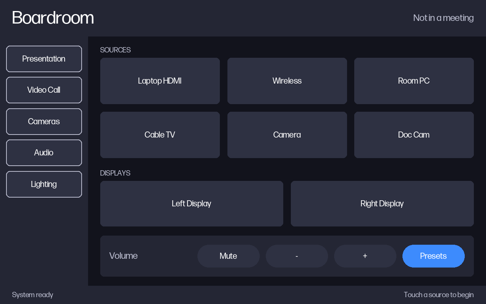
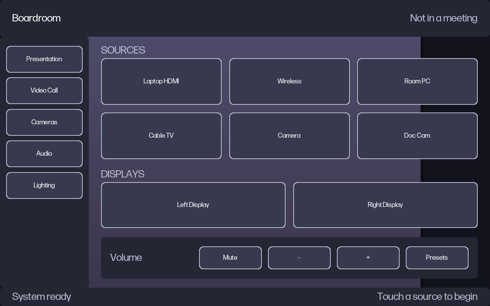

# Building a panel from scratch

Can you design an Extron touch panel as an artefact — a spec, a mockup, a
generated layout — and turn it into a real `.gdl` that GUI Designer opens and
builds? This is the answer as far as it can be established without Windows,
which is further than expected.

**Short version.** Yes, and the design space is considerably wider than early
drafts of this file claimed. *Build owns the artwork* is real, but: the canvas is
one of eight resolutions rather than fixed, lines can be diagonal, ~339 icons are
available as font glyphs needing no image resource, new border resources can be
appended (§5), and Extron ships per-panel `.glt` template libraries to clone from.
`docs/design-rules.md` holds Extron's own rules, separated from what we guessed.

## 1. What actually bounds the design space

An authored control carries `TLPImageID = -1`. It has no artwork. What it has is
a fill colour, a stroke colour, and a **named** border resource that supplies
the silhouette. GUI Designer rasterises those on Build. So a generator never
makes pixels; it names resources and sets colours.

The obvious reading of that — and what the older notes imply — is that a
generator is limited to the seven border resources the shipped panel references.
That reading is wrong. `gdl/project.py`'s `border_resources()` enumerates
`PBResourceReferenceBorder`, which is *bindings in use*, not definitions. The
definitions live in `PBProject.resourceSetField`, and there are far more of them:

| Class | Count in `_alt 2_0_0` |
|---|---|
| `PBBorderResource` | **34** |
| `PBImageResource` | 38 |
| `PBFontResource` | 4 |

Of the 34 borders, 28 are System-authored (`authorField = 0`) templates and 6
are the User-authored `Afterburn - *` ones. Read out of their `dataField`
(`PBBorderInfo`), the parametric vocabulary is:

| | values present |
|---|---|
| shape | rectangle family (1), ellipse (2) |
| style | 2D flat (0), 3D bevelled (1) |
| corner radius | 0, 5, 10, 14, 999, 9999 (9999 = capsule) |
| thickness | 0, 1, 2, 3 |
| 3D lighting | `depth`, `surfaceHeight` (3, 78, 117) |

The six Afterburn resources are **not** clones of the System templates, which
is more interesting than if they were. Every one carries `style = 0` (2D flat)
together with `depth = 1, surfaceHeight = 3` (the 3D lighting values) — and no
System template has that combination: every System `style = 0` record has
`depth = 0, surface = 0`, and every record with `depth = 1, surface = 3` has
`style = 1`.

So a human, working in GUI Designer's own UI, produced border resources with
parameter combinations that ship with no template. §5 confirms the stronger
version: a **hand-appended** resource with out-of-corpus values also survives a
build.

**The consequence that matters:** a generator that only *references* resources
already in a donor project needs no new resource appended.

Worth knowing how narrow the corpus evidence was: across all six fixtures only
**9** distinct border names are ever bound to a control, and ~25 — including
*every* 3D template and every `zGD - Default *` — are defined but never
referenced. §5 tested one of those unreferenced names directly and it built
clean, so the usable palette is the full **34**, and appending more works too.

## 2. What is free, what is bounded, what is impossible

**Free.** Layout and hierarchy, page and popup structure, ID allocation, exact
fill/stroke/text colour (any ARGB), typography within the embedded faces, and
which border resource each control uses — all 34, confirmed in §5.

**Bounded — less than expected.** Silhouette is
rectangle/rounded/capsule/ellipse × flat/3D. A new radius means a new resource,
and §5 showed appending one works, so this is bounded by the shape *family*
rather than by the resource list.

**Impossible without new resources, and possibly impossible at all.**

- `PBLine` cannot be **freehand or polyline**. Its `startPoint`/`endPoint` are an
  eight-value enum (TopLeft, TopCenter, TopRight, MiddleRight, BottomRight,
  BottomCenter, BottomLeft, MiddleLeft) plus start/end caps and thickness — so
  TopLeft→BottomRight *is* a diagonal, and since the bounding rect is arbitrary so
  is the angle. Earlier drafts of this file said "no diagonal line"; that was wrong.
- Canvas size is set by the panel model, **not fixed**: GUI Designer supports eight
  resolutions from 320×240 to 1920×1080 across 63 platform classes. The fixtures are
  all 1280×800, which is a property of this client's hardware, not of the format.
  See `docs/design-rules.md` §1.
- Arbitrary raster art: unless the bitmap is already a `PBImageResource` it needs
  the resource-append step (which §5 showed works). But note this is rarely the
  binding constraint — ~339 icons are available as *font glyphs* and need no image
  at all. See `docs/design-rules.md` §6.
- Gradients beyond what `depth`/`surfaceHeight`/`lightAngle`/`lightBrightness`
  produce.

## 3. The pipeline, and what exists today

| Stage | State |
|---|---|
| Design artefact → spec | **Built.** `examples/panel.json` is a worked spec. |
| Layout pass | **Built.** `gdl/spec.py` `grid()` / `stack()`. |
| Control ID allocation | **Built.** Per-page bands, honours pinned ids. |
| Preview render | **Built.** Straight through `gdl/compose.py`. |
| Spec → build plan | **Built.** `python -m gdl.spec plan`. |
| Plan → `ProjectGCP` | **Built and verified.** `powershell/Apply-GdlPlan.ps1`; `-WhatIf` dry-runs it. |
| Repack to `.gdl` | Built already — `gdl/container.py pack`. |
| GUI Designer opens + builds | **Verified**, and scriptable from the host (§7). |

Note one correction to `CLAUDE.md`'s gap list: **group registration is not
missing.** `Register-GdlPopupGroup` is a complete, exercised implementation of
the only group concept the format has (a class census finds exactly five
`PBControlGroup` instances across the whole corpus, all popup-page groups). The
genuine gaps were control-level ID allocation and a layout pass, and both are
now in `gdl/spec.py`.

## 4. The preview is the point

The expensive step is the round trip to a Windows box with GUI Designer
installed. The compositor now scores **2.19% mean** differing pixels against
GUI Designer's own snapshot exports, which makes it good enough to judge a
design *before* paying that cost:

```bash
python -m gdl.spec check  examples/panel.json     # ids, off-canvas, sizes, unknown resources
python -m gdl.spec render examples/panel.json out/preview.png
python -m gdl.spec plan   examples/panel.json out/plan.json   # ops for the applier
```



That image is a panel that has never existed: 28 controls, every rect computed
by the layout pass, every id allocated, rendered by the same code path that is
measured against ground truth. §5b shows the same spec after GUI Designer has
actually built it, which is the proof; this is the cheap check you run first.

The preview is honest about what it is drawing: every control is emitted with
`TLPImageID = -1`, exactly as an authored control is before Build, so the
preview draws from the same fill-plus-named-border properties a writer would
set.

## 5. Tested against GUI Designer 1.27.0.9 — results

Run on 2026-09-07 in a Parallels Windows 11 VM with GUI Designer installed.
Each test project was authored **headlessly** by PowerShell, packed with
`gdl.container pack`, then opened and built in the real application. See §7 for
how that was driven, which is fully scriptable.

| | Question | Answer |
|---|---|---|
| 1 | Reference an existing but never-referenced border resource? | **YES** |
| 2 | Append a *new* `PBBorderResource` and bind to it? | **YES** |
| 3 | Out-of-corpus `PBBorderInfo` values? | **Builds clean** (visual check still open) |
| 4 | Cross-graph `Copy-GdlObject`? | **YES** |
| 5 | ID / name uniqueness enforcement | **NAMES yes, hard error**; ids untested |
| 6 | `referenceCountField` semantics | not yet tested |

**1 — referencing an unused resource works.** A `PBShape` was repointed from
`Afterburn - 10 Radius 0 Thick` to `3D Capsule`, a System template no control in
any fixture binds. GUI Designer opened it and built with **0 errors, 0
warnings**. So §1's conclusion holds: the usable palette is all **34** defined
resources, not the 6 this project happens to reference.

**2 — appending a new resource works, so the design space is fully
parametric.** A `PBBorderResource` was cloned, renamed
`Claude - 20 Radius 1 Thick`, given `cornerRadius = 20` and `thickness = 1`
(a combination present nowhere in the corpus), appended to
`resourceSetField.resourcesField` with `.Add()`, and bound to a control. It
opened, built with 0 errors, and the new resource **survived into the built
file** — still present, still bound, verified afterwards with `gdl/project.py`.

This was the biggest open question and it is the more permissive answer: a
generator is not limited to a donor's existing resources.

**4 — cross-graph cloning works.** A control was cloned out of one
independently-deserialised project into another with `Copy-GdlObject`, and the
result opened, built clean, and rendered correctly (the cloned popup reference
paints its group member, per render finding 3). A curated component library in a
separate `.gdl` is therefore viable.

**5 — page and popup names must be unique project-wide.** Found the expensive
way. The worked example's two popups were named `2210 - Conference Volume` and
`2220 - CATV Volume` — perfectly sensible names, and unique *within the spec*.
But a generated panel joins the **donor's** project, and the Liberty Bank donor
already had both. Build rejected it:

    2210 - Conference Volume   Duplicate page or popup page names are not
                               allowed within the same project.
    2220 - CATV Volume         Duplicate page or popup page names are not
                               allowed within the same project.

Two errors, no payload. Points worth keeping:

* Pages and popups share **one** namespace — a popup may not take a page's name.
* It is a **build** error, not a load error. GUI Designer opened the file
  happily and showed both duplicates in the workspace tree, so "it opens" says
  nothing here.
* The **name** is the only identity that matters. Page "number" (the `2210 -`
  prefix) is a naming convention, not a field: `PBPage` has no number, and the
  fixture's own names are just numerically prefixed strings.
* Numeric `idField`s were duplicated across projects throughout this work with
  no complaint, so whatever uniqueness ids need, it is not this one.

`Panel.check_donor()` now compares spec names against the donor's before
anything leaves the Mac, and `Panel.check()` catches a spec that collides with
itself. Renaming to `2310 - Program Volume` / `2320 - Speech Volume` cleared it:
the build emitted `generated9.tgz4` with 207 PNGs (a failed build emits none),
661 of 698 controls rasterised, and both popups came through with their own
captions.

**And the file was still wrong** — see the next finding, which is the more
important one.

**A control that does not fit its page is moved to 0,0. Silently, at build
time, with the build still reporting success.** The clean build above was
checked by rendering it, and one button was missing from each popup. Reading the
built `layout.json` back:

    2310 - Program Volume  (page is 915x800)
        Mute     256,24  164x60
        -        436,24  164x60
        +        616,24  164x60
        Presets    0,0   164x60     <- planned 796,24

Every relocated control is exactly one whose right edge passed **915** — the
donor popup's width. The applier sized nothing, so each cloned popup kept the
donor's dimensions while the spec laid its controls out across 984. Note what
survived: the width and height are the planned ones, only the position was
rewritten, so the object is not corrupt and nothing in the file says it was
touched.

Consequences worth keeping:

* **A popup's size must be authored** (`widthField` / `heightField`; both
  `PBPage` and `PBPopupPage` carry them). A clone inherits the donor's, and the
  donor's is arbitrary.
* **"It built with 0 errors" is not a correctness check.** This is the second
  trap of this shape after `flattenText`, and both produced a file that opened,
  built and was wrong.
* So the loop now ends with `python tests/verify_built.py <plan.json>
  <built.gdl>`, which reads the plan and the built file and asserts every
  authored control's rect and caption. It reproduces this defect exactly and
  reports 0 problems on the fixed build.

**What Build adds by itself.** The generated page came back with 35 controls
against 29 authored, which looked like clone contamination and is not: Build
adds one full-canvas `PBPopupPageReference` per **modal** popup to **every**
page, and the donor has exactly six modal popups. Every donor page carries the
same six. The verifier ignores unauthored extras for this reason.

### Two things the run corrected

**`Project > Verify` (Ctrl+B) is not the build.** It reports "Build Complete -
0 error(s), 0 warning(s)", which reads exactly like a build, but it only
validates. Saving after it writes a `.gdl` containing **only `ProjectGCP`** —
GUI Designer drops the stale payload rather than regenerating it. The real build
is **File > Save and Build (Ctrl+Shift+B)**, which emits the payload member,
named after the file lowercased (`testb.tgz4`).

**`BuildProject()` cannot be driven headlessly.** `PBProject.BuildProject()` is
the method the build dialog's worker calls, and `BuildManager` has a public
constructor taking just a `PBProject` — but calling it throws
`NullReferenceException` inside `BuildProject()`, in an interactive session as
well as a service one. It needs state only a properly-initialised GUI Designer
process has. Driving the real UI (§7) is the working route.

## 5b. The whole loop, closed

`examples/panel.json` — a spec written on a Mac — was taken end to end:

    spec -> layout pass + ID allocation -> build plan -> Apply-GdlPlan.ps1
         -> ProjectGCP -> gdl.container pack -> GUI Designer -> Save and Build

GUI Designer opened it and built with **0 errors, 0 warnings**, producing a page
of 34 controls with 28 rasterised assets. `docs/generated-built.png` is that
page rendered from GUI Designer's *own* built payload — not a preview:



Every rect came from `grid()`/`stack()`, every id from the allocator, every
caption from the spec.

Three defects had to be fixed along the way, all of them the same shape - a
clone inherits things you did not ask for:

1. **The page kept the donor's page-level artwork**, which painted underneath
   everything. Clear `<TLPImageID>` on the cloned page.
2. **Buttons kept the donor's icon.** Clear `buttonImageField`.
3. **`flattenText` bakes the caption INTO the artwork at build time**, and the
   clone inherited it - so Build deduplicated all five nav buttons to a single
   asset carrying the donor's word "Audio", with the correct captions sitting
   unused in `layout.json`. Set `flattenTextField = false` and the firmware
   draws captions live, which is what it does for hand-authored panels anyway.

That third one is worth remembering: the file was *correct* the whole time -
`layout.json` had the right text - and only the rendered artwork was wrong.
Checking the model would have said everything was fine.

## 6. Honest limits of everything above

- Questions 5 and 6 are untested.
- Test 3 is only half-answered: an out-of-corpus radius/thickness *builds*, but
  nobody has looked at whether it *rasterises* correctly. The control used was
  the Offline Window, which Build legitimately leaves unrasterised, so there is
  no artwork to inspect. Redo it against a visible control.
- Colour fidelity is not there yet: the accent button and some panel fills did
  not survive, and the generated page still shows a band of donor page artwork
  behind the content area. Geometry, captions, IDs and structure are correct;
  colour plumbing needs another pass.
- The resource counts are from the `_alt 2_0_0` fixture. The two archived
  fixtures carry 36 border resources, so the number is project-specific.
- The preview's fidelity is measured against pages made of *built* artwork. A
  page of `TLPImageID = -1` controls is exercised by exactly one control in the
  whole corpus (the Offline Window), so the preview's accuracy on a fully
  synthetic page is inferred from that one data point, not measured.

## 7. Driving GUI Designer from the host

The round trip is scriptable end to end from macOS against a Parallels VM, which
is what made §5 cheap enough to do properly.

```bash
# runs as SYSTEM, non-interactive - fine for authoring, no UI
prlctl exec "Windows 11" 'C:\Windows\SysWOW64\WindowsPowerShell\v1.0\powershell.exe' \
    -NoProfile -ExecutionPolicy Bypass -File '\\Mac\Home\...\out\make-tests.ps1'

# runs as the logged-on user WITH a desktop - needed for anything that draws
prlctl exec "Windows 11" --current-user ... -File '...\out\sendkeys.ps1' -Keys '^+b'

prlctl capture "Windows 11" --file /tmp/vm.png     # read the result back
```

Two things to know:

- **`--current-user` is the whole trick.** Without it `prlctl exec` runs as
  `nt authority\system` with `UserInteractive = False`, and anything that shows
  a form dies with "Showing a modal dialog box or form when the application is
  not running in UserInteractive mode".
- The host filesystem is reachable in the guest at `\\Mac\Home\...`. The `Z:`
  mapping is per-interactive-session and is **not** visible to `prlctl exec`;
  use the UNC path.

`out/sendkeys.ps1` activates GUI Designer's window and sends keystrokes, which is
enough to drive Open / Verify / Save and Build.
